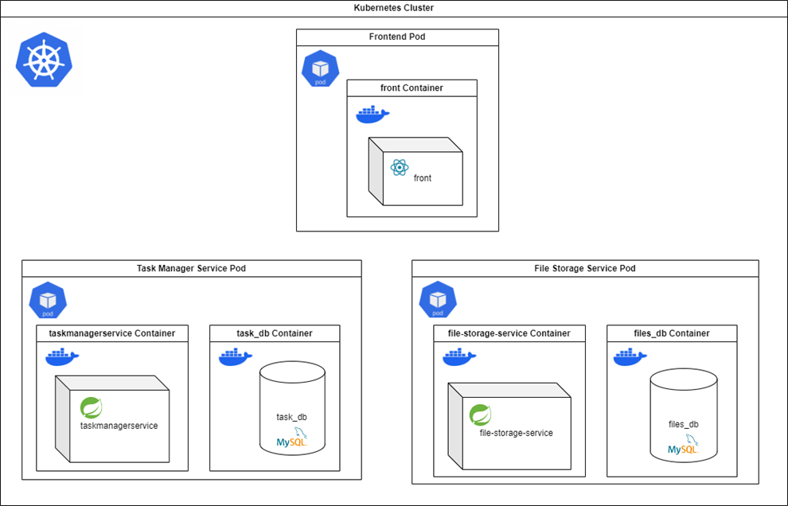

# SE-for-the-cloud-To-Do-App

# TodoApp

This repository contains the source code for a TodoApp application built with Kubernetes and Docker.

## Contributors

- Sabrina MOHAMMEDI
- Vanessa MOHAMMEDI

## Diagram



## Prerequisites

Before you begin, ensure you have the following installed:

- Docker
- Minikube

## Getting Started

1. **Start Docker:**
   ```bash
   start /min docker
   ```

2. **Start Minikube:**
   ```bash
   minikube start
   ```

3. **Pull Docker images:**
    ```bash
    docker pull sabrinam2/todoapp-frontendservice:latest
    docker pull sabrinam2/todoapp-taskmanagerservice:latest
    docker pull sabrinam2/todoapp-filestorageservice:latest
    ```

4. **Apply Kubernetes configurations:**
    ```bash
    ## Frontend service:
    kubectl apply -f front/frontend-deployment.yaml
    kubectl apply -f front/frontend-service.yaml
    
    ## Task Manager service:
    kubectl apply -f taskmanagerservice/taskmanagerservice-mysql-pod.yaml
    kubectl apply -f taskmanagerservice/taskmanagerservice-service.yaml
    
    ## File Storage service:
    kubectl apply -f file-storage-service/filestorageservice-mysql-pod.yaml
    kubectl apply -f file-storage-service/filestorageservice-service.yaml
    
    ## Ingress configuration:
    kubectl apply -f ingress.yaml
   ```

### Retrieve the IP address of Ingress:

   ```bash
   kubectl get ingress
   ```

**On Linux:** edit the `/etc/hosts` file and add at the bottom values for:

`ADDRESS     HOSTS`

**On Windows:** edit the `c:\windows\system32\drivers\etc\hosts` file, add

`127.0.0.1 todoapp.info`

### Start a Minikube tunnel
   ```bash
   # Enable Ingress DNS addon:
    minikube addons enable ingress-dns
    
    # Start Minikube tunnel:
    minikube tunnel
   ```

Then check in your Web browser:

http://todoapp.info/

## Automation of the deployment

The necessary commands have been listed in the `deploy.sh` file for Linux or the `deploy.bat` file for Windows.

**To use this file you must have completed the following steps:**

**On Linux:** edit the `/etc/hosts` file and add at the bottom values for:

`ADDRESS     HOSTS`

**On Windows:** edit the `c:\windows\system32\drivers\etc\hosts` file, add

`127.0.0.1 todoapp.info`

Once this configuration is done, this command will automatically launch all the necessary commands listed above for the deployment of the services and the ingress configuration:

**On Windows, run:**

   ```bash
   .\deploy.bat
   ```
**On Linux, run:**

   ```bash
   ./deploy.sh
   ```

At the end of the execution, you must use the following commands to start a Minikube tunnel:

 ```bash
   # Enable Ingress DNS addon:
    minikube addons enable ingress-dns
    
    # Start Minikube tunnel:
    minikube tunnel
   ```

Then check in your Web browser:

http://todoapp.info/


## Usage

You can access different parts of the application using the following URLs:

- **Application Frontend:** [http://todoapp.info](http://todoapp.info)
- **Task Manager Service API:** [http://todoapp.info/api/tasks](http://todoapp.info/api/tasks)
- **File Storage Service API:** [http://todoapp.info/api/files](http://todoapp.info/api/files)

## Swagger Documentation
 
A Swagger documentation has been generated for each of the backend services.

To access it, build the service of your choice and access the following URLs:

- http://localhost:8081/swagger-ui/index.html for the TaskManagerService, or
- http://localhost:8082/swagger-ui/index.html for the FileStorageService.


